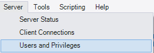

<style>
    p, ul, li {font-size: 20px;}
    a{color:grey; text-decoration:underline;}
    a:hover{color:#eee;}
    section{justify-content:flex-start;}
</style>

# Opdracht 2 - Een databankserver opzetten in een virtuele machine

**Hoofdstukken**:

1. VirtualBox configureren
2. Virtuele machine aanmaken
   1. Configuratie databankserver
   2. Debugging en troubleshooting
3. Configuratie databankserver
   1. Configuratie van de databank
   2. MySQL Workbench
4. Afsluiten

> Maxence, Mauro, Robin, Thomas , Xander

---

# VirtualBox configureren

> Op Windows

1. `File` > `Tools` > `Network Manager`
   Een nieuwe VirtualBox Host-Only Ethernet Adapter aanmaken met deze waarden:

   ```css
   IPv4-adres: 192.168.56.1
   Netwerkmasker: 255.255.255.0
   DHCP-server: aan
   DHCP-server adres: 192.168.56.100
   Laagste adres: 192.168.56.101
   Hoogste adres: 192.168.56.254
   ```

2. `VM-machine Settings` > `netwerk` > `Adapter 2`
   We zetten deze `aan` en veranderen volgende info:
   ```
   Attached to: Host-only Adapter
   Naam: Virtualbox Host-Only Ethernet Adapter
   ```

---

# Virtuele machine aanmaken `ubuntu.com .iso`

1. Dowload `Ubuntu 22.04.iso` van **Ubuntu.org/download/desktop** of via **osboxes.org/ubuntu/**
2. Maak een nieuwe Virtual Box aan met min. `2GB RAM`, voldoende opslag en alle andere mogelijke instellingen.
3. De stappen van de installatie volgen
   Done

Daarna hebben we enkele netwerkinstellingen in Ubuntu zelf aangepast in **settings**. Daar zijn er 2 interfaces beschikbaar.

- interface `enp0s8`.
  - Kies het tabblad **IPv4** en geef volgende instellingen in:
    ```css
    IPv4 Method: manual
    Address: 192.168.56.20
    Netmask: 255.255.255.0
    Gateway: LEEG
    ```

---

# Configuratie databankserver

We installeren MySQL in de terminal en controleren of de service draait

```
sudo apt update
sudo apt install -y mysql-server

systemctl status mysql
```

Controleer welke netwerkpoorten in gebruik zijn en stel vast dat MySQL enkel luistert op de "loopback interface":

```bash
sudo ss -tlnp
```

##  [Running] - Oracle VM VirtualBox 03_03_2024 14_04_38.png>)

# Debugging en troubleshooting

- `systemctl status mysql` - Prosessen bekijken
- ...

---

# Configuratie van de databank

```bash
sudo mysql
```

> Enkel eerste keer, daarna is het `mysql -u root -p`.

```mysql
use mysql;
alter user 'root'@'localhost' identified with mysql_native_password by 'letmein';
```

```mysql
create user 'admin'@'%' identified by 'letmein';
grant all privileges on *.* to 'admin'@'%' with grant option;
flush privileges;
exit;
```

> Gebruik deze user om in te loggen met Workbench, daarvoor moeten we wel eerst nog doen:
>
> ```bash
> sudo mysql_secure_installation
> ```

---

# Configuratie van de databank

Alle vragen beandwoorden zoals in Github:

- Validate Password activeren? `NEE`
- Wachtwoord voor **root** aanpassen? `NEE`
- Remove anonymous users? `JA`
- Disallow root login remotely? `JA`
- Remove test database? `JA`
- Reload Privileges table? `JA`

---

# MySQL Workbench - Verbinden


- Maak een nieuwe verbinding aan.
- Kies een naam voor de verbinding (bv. `UbuntuVM-admin`).
- Hostnaam: `192.168.56.20`
- Username: `admin`
- Test eerst de verbinding en sla het wachtwoord op in de "vault".

---

# MySQL Workbench - toevoegen - Schema


> Name `appdb`

---

# MySQL Workbench - toevoegen - gebruiker




---

# Afsluiten

> `Power Off/Log out` > `Power Off`

of

> ```bash
> sudo poweroff
> ```

---

## Mogelijke uitbreidingen

Een aantal optionele, maar mogelijks handige instellingen om aan te passen in je VM zijn:

1. Schakel de screen lock uit.
2. Laat de gebruiker **osboxes.org** automatisch inloggen.
3. Installeer handige applicaties zoals Visual Studio Code.
4. Pas het wachtwoord van de gebruiker **osboxes** aan. Schrijf dit wachtwoord zeker op in de beschrijving van de VM via **Settings** > **General** > **Description**.
5. Probeer of je met FileZilla/Cyberduck bestanden van/naar de VM kan kopiëren. Dit zal extra configuratie vereisen.
6. Configureer de VM zodat je via SSH kan inloggen vanop je fysieke systeem (via een wachtwoord en/of public/private keypair).

---

# Mogelijke uitbreidingen `#1`

> Schakel de screen lock uit.
> `Maxence`, `Mauro`, `Thomas`


---

# Mogelijke uitbreidingen `#2`

> Laat de gebruiker **osboxes.org** automatisch inloggen.
> `Maxence`, `Mauro`, `Thomas`


---

# Mogelijke uitbreidingen `#3`

> Installeer handige applicaties zoals Visual Studio Code.
> `Maxence`, `Mauro`, `Thomas`


---

# Mogelijke uitbreidingen `#4`

> Pas het wachtwoord van de gebruiker **osboxes** aan.
> `Maxence`, `Mauro`, `Thomas`


---

# Mogelijke uitbreidingen `#5`

> Probeer of je met FileZilla/Cyberduck bestanden van/naar de VM kan kopiëren. Dit zal extra configuratie vereisen.
> `Maxence`, `Mauro`, `Thomas`


---

# Mogelijke uitbreidingen `#6`

> Configureer de VM zodat je via SSH kan inloggen vanop je fysieke systeem (via een wachtwoord en/of public/private keypair).
> `Maxence`, `Mauro`, `Thomas`


