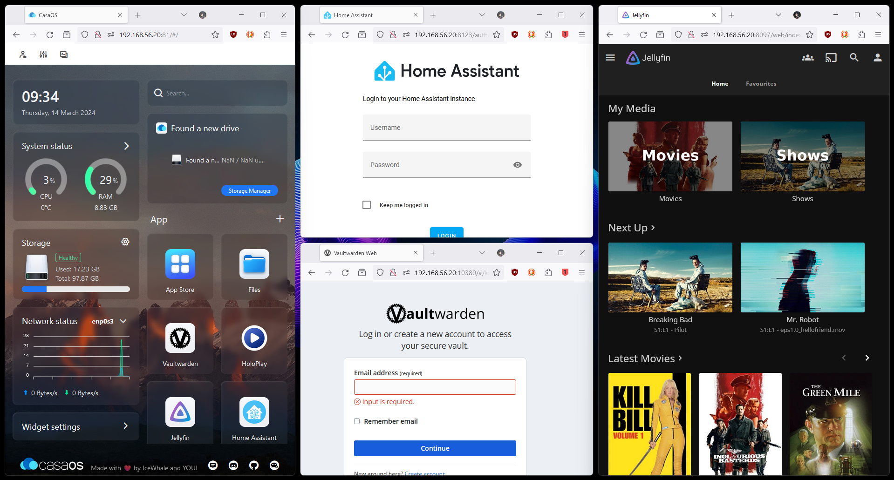

<style>
    p, ul, li {font-size: 20px;}
    a{color:grey; text-decoration:underline;}
    a:hover{color:#eee;}
    section{justify-content:flex-start;}blockquote{
      color: #5865f2;
      border-left: 0.25em solid #5865f2;
   }
</style>

# Opdracht 3 - Een databankserver opzetten in een virtuele machine

**Outline**:

1. Installatie
2. Een statische website publiceren
3. Een webserver beveiligen met SSL
4. Een webserver beveiligen met een firewall
5. Een webserver beveiligen met fail2ban

**Extra**

1. Marp presentaties

---

# Installatie

- Instaleren: `sudo apt install apache2`
- Bekijken of Apache2 aanstaat: `systemctl status apache2`
  
- Kan je deze info bekijken vanuit je webbrowser? `ja`

Bestanden overzetten kan met **Filezilla** naar de folder `/var/www/html/`

---

# Een statische website publiceren

> Permissies opzetten

- Gebruiker toevoegen aan de groep `www-data`
  ```
  sudo usermod -aG www-data gebruiker
  ```
- Vervolgens maak je de Document Root eigendom van de groep `www-data`
  ```
  sudo chgrp -R www-data /var/www/html/
  ```
- Tenslotte ken je alle leden van de de groep `www-data` schrijfrechten toe op de Document Root
  ```
  sudo chmod -R g+w /pad/naar/document/root
  ```

---

# Een statische website publiceren

> Filezilla Opzetten (Uitbreiding vorige verslag)

`sudo apt install openssh-server`

Je kan controleren of ze draaien met:

- `systemctl status ssh`
- `ss -lntu | grep ssh`


---

# Een webserver beveiligen met SSL

Van  naar  door hulp van:

```
sudo a2enmod ssl
sudo a2ensite default-ssl
sudo systemctl reload apache2
```

`firewall poort 443`

---

# Een webserver beveiligen met een firewall

1. `sudo lsof -i -P -n | grep LISTEN`
   

2. `sudo ufw enable`
3. `sudo ufw allow apache`, `sudo ufw allow 80`, `sudo ufw allow ___`
4. Test opnieuw via browser
   

---

# Een webserver beveiligen met fail2ban

`sudo apt install fail2ban`
`sudo systemctl enable fail2ban`

**jail.local**

```
[sshd]
port    = ssh
logpath = %(sshd_log)s
backend = %(sshd_backend)s
maxretry = 6
findtime = 180
bantime = 900
```

> Uitzondering toevoegen voor een eigen VM - enkele zaken testen.

---

# Mogelijke uitbreidingen `#1`

> Hydra
> `Maxence` , `Xander`

---

# Mogelijke uitbreidingen `#2`

> Awesome selfhosted
> `Mauro`, `Maxence`



---

# `EXTRA` Marp presentaties 

```md
---
marp: true
---

# Opdracht 3 - Een databankserver opzetten in een virtuele machine

**Outline**:

1. Installatie
2. Een statische website publiceren
3. Een webserver beveiligen met SSL
4. Een webserver beveiligen met een firewall
5. Een webserver beveiligen met fail2ban

---

# Installatie

- Instaleren: `sudo apt install apache2`
- Bekijken of Apache2 aanstaat: `systemctl status apache2`
  
- Kan je deze info bekijken vanuit je webbrowser? `ja`

Bestanden overzetten kan met **Filezilla** naar de folder `/var/www/html/`

---

lorem
```
