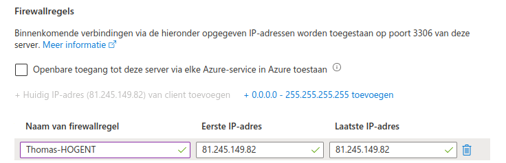
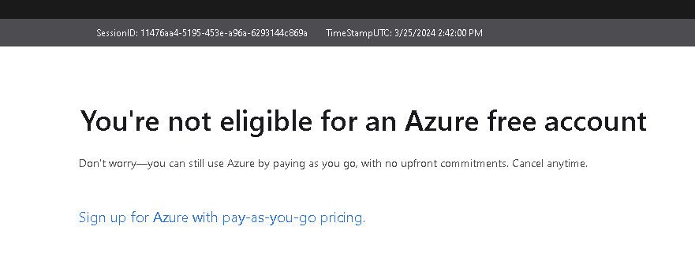
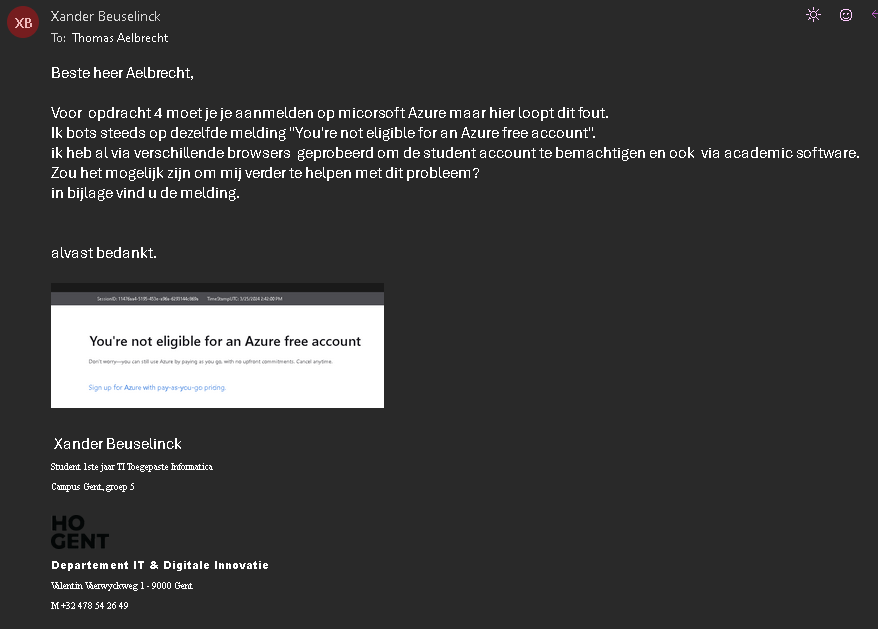
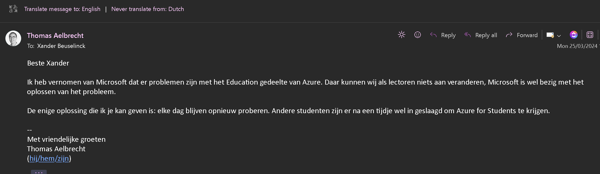
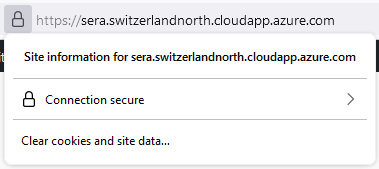
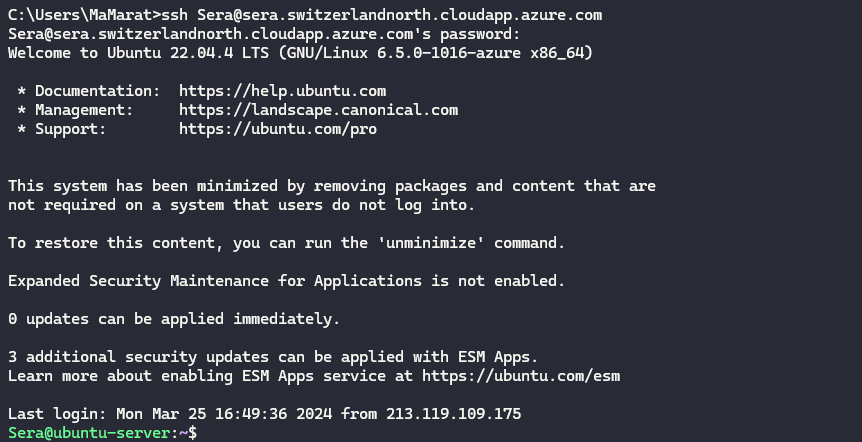
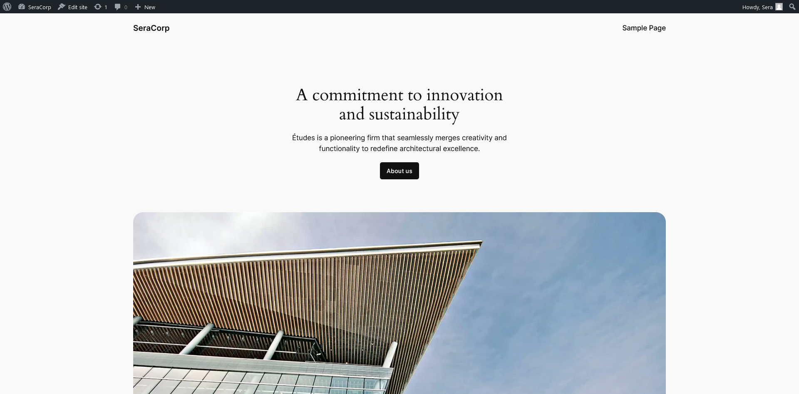
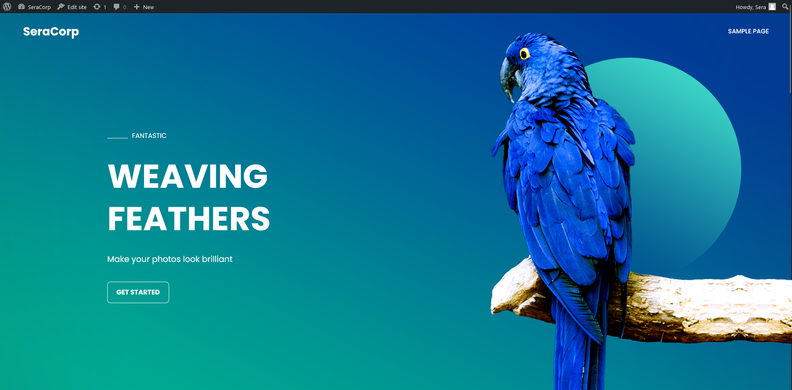
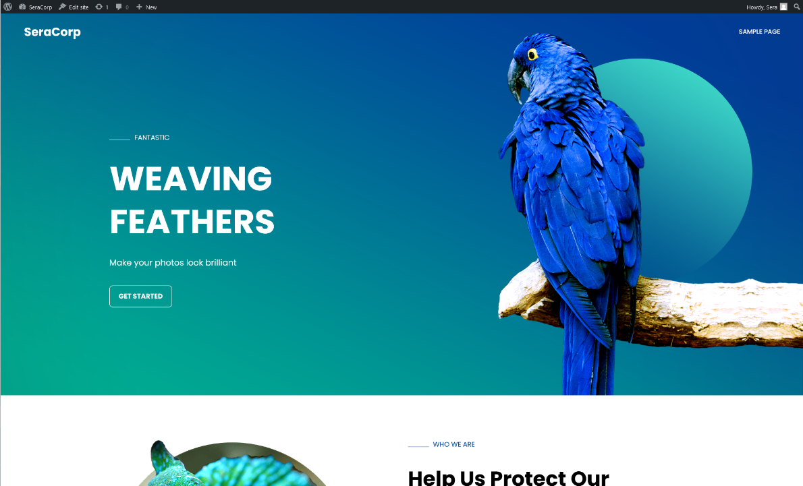
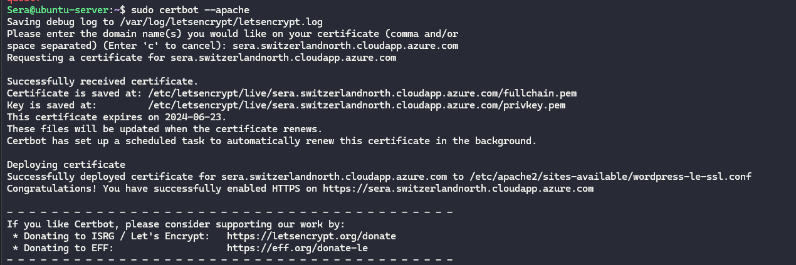

# Opdracht 4 - Azure Wordpress

**Hoofdstukken**:

1. Microsoft Azure
2. MySQL Databankserver
3. Ubuntu Applicatieserver
4. Servers configureren
   1. Overzicht
   2. DNS configureren
   3. Toegeang tot MySQL
5. Wordpress
6. Beveiliging HTTPS
7. Uitschakelen
8. Problemen met Azure
9. Uitbreiding

> Mauro, Maxence, Robin, Thomas , Xander

---

<!-- header: 1. Microsoft Azure -->

# Microsoft Azure

- Account aanmaken: `https://azureforeducation.microsoft.com/devtools`
- Dit account is gelinkt met HoGent Email

---

<!-- header: 2. MySQL Databankserver -->

# MySQL databankserver maken

- Via `Een resource maken` en vervolgens bij `Databases` te clicken
- Verkrijgen we `Azure Database for MySQL`
  

- Vervolgens `Maken` te clicken

---

# MySQL databank configureren

- Abonnement: `Azure voor studenten`
- Maak een nieuwe Resourcegroep aan met de naam `SELabs-Wordpress`
- Servernaam: zelf te kiezen (hou dit bij in de overzichtstabel)
- Locatie: `West Europe`
- Versie: laatste versie (8.0)
- Workloadtype: `Voor ontwikkelings- of hobbyprojecten`

---

# MySQL opslag configureren

- Berekeningslaag: `Met burstmogelijkheden (1-20 vCores): meest geschikt voor workloads waarvoor niet continu de volledige CPU hoeft te worden gebruikt`
- Grootte berekening: `Standaard_B1s (1 vCore, 1 GiB RAM, 400 maximale iops)`
- IOPS: `Vooraf ingerichte IOPS`
- Verder de standaard instellingen laten staan.
- Klik op `Opslaan`

---

# MySQL Verificatie en Netwerk configureren

- Gebruikersnaam en wachtwoord
- Huidige ip toelaten door firewall
  
  

---

# MySQL is gemaakt

- Klik vervolgens op `Maken`

---

<!-- header: 3. Ubuntu Applicatieserver -->

# Ubuntu Applicatieserver

- Weer via `Een resource maken`

- Dezelfde stappen gelden als MySQL database

---

<!-- header: 4. Server configureren: Overzicht -->

# Overzicht van servereigenschappen

- Navigeer in Rescources naar opgemaakte Databank
- Overzicht van instellingen (aanpassingen mogelijk)

---

<!-- header: 4. Server configureren: DNS configureren -->

# DNS configureren

- DNS instellen in applicatie server

- Ter controle: `ssh <gebruikersnaam>@<dns-naam>`

---

<!-- header: 4. Server configureren: Toegang to MySQL -->

# Applicatie server toegang geven aan MySQL

- Maak een ssh verbinding: `ssh <gebruikersnaam>@<dns-naam>`
- Update de package repositories: `sudo apt update`
- Upgrade de nodige packages: `sudo apt upgrade`
- Installeer de MySQL client: `sudo apt install mysql-client`
- In het databankoverzicht onder `Netwerken` voegen we een publike-ip toe
- Noemen we Applicatieserver en het ip is te vinden in het applicatie overzicht in Azure

- Maak een connectie met de databank: `mysql -h <dns-naam> -u <gebruiker> -p`

---

<!-- header: 5. Wordpress -->

# Wordpress

- In de Applicatieserver download je WordPress: `https://ubuntu.com/tutorials/install-and-configure-wordpress#1-overview`

  1.  Instaleer overige depndencies (packages)
      - mysql server is al geinstaleerd
  2.  Install WordPress
  3.  Configureer apache voor WordPress
      - hostname moest niet aangevuld worden
  4.  Configureer de MySQL database
      - Data base bestaat al
      - Alleen nodige data base setup
  5.  Configureer WordPress met de database
  6.  Configureer WordPress

  
  
  

---

<!-- header: 6. Beveiliging HTTPS -->

# Beveiliging HTTPS

- HTTPS verkrijgen via `https://certbot.eff.org/instructions?ws=apache&os=ubuntufocal`
  1.  SSH verbinding met uw server
      - Hebben we al erder gedaan
  2.  Install snapd
      - Is al geinstallerd
  3.  Install Certbot
      - `sudo snap install --classic certbot`
  4.  Maak een link
      - `sudo ln -s /snap/bin/certbot /usr/bin/certbot`
  5.  Koppel apache met Certbot
      - `sudo certbot --apache`
  6.  Test voor automatische hernieuwing
      - `sudo certbot renew --dry-run`

---

<!-- header: 7. Uitschakelen -->

# Machines uitschakelen

- De `Stoppen` knop is terug tevinden in je machines overzicht

---

<!-- header: 8. Problemen met Azure -->

# Problemen met Azure student account

- De melding

()

---

# Wat heb ik gedaan

- Mail verstuurd naar vak verantwoordelijke

---

# Het antwoord

- Antwoord op mijn mail

---

<!-- header: 9. Uitbreiding -->

# Uitbreiding `#1`

> SSH key
> `Mauro`

---

# Uitbreiding `#2`

> Ander thema in WordPress
> `Mauro`

<!--  -->

---

# Uitbreiding `#4`

> Andere beveiliging
> `Mauro`

# Uitbreiding `#6`

> VM in Azure
> `Mauro`
