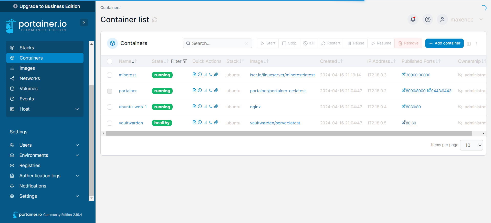
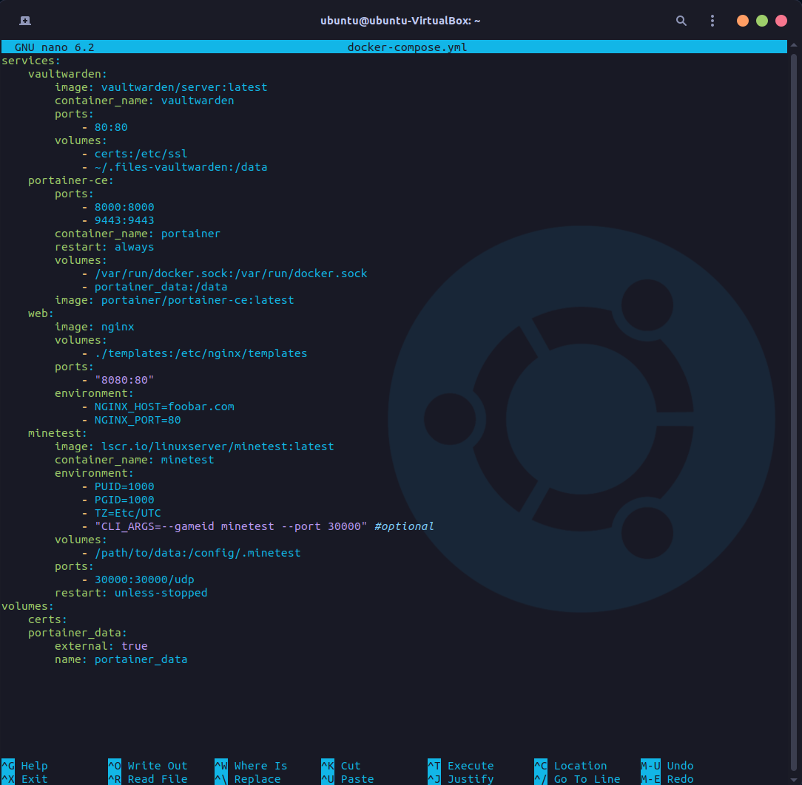
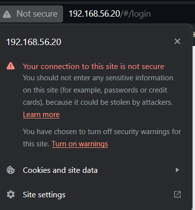
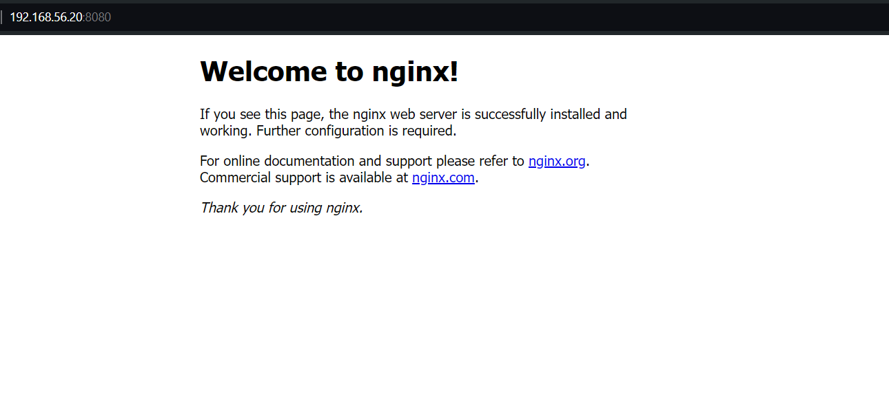
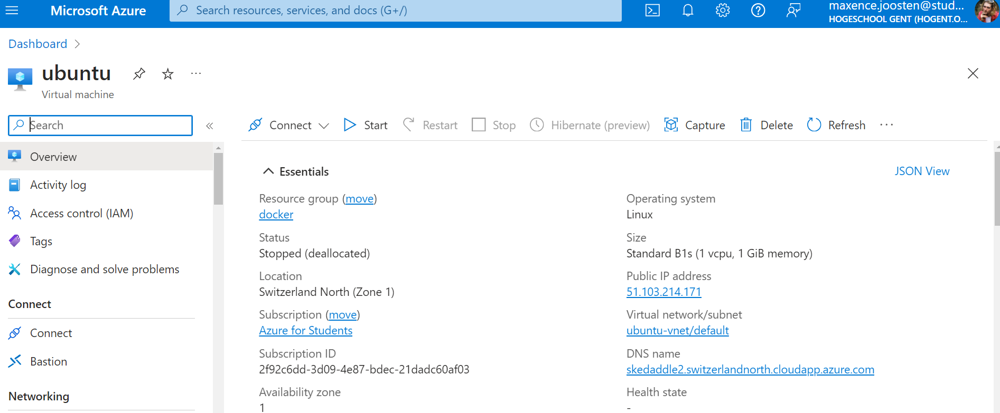

<style>
    p, ul, li {font-size: 20px;}
    a{color:grey; text-decoration:underline;}
    a:hover{color:#eee;}
    section{justify-content:flex-start;}blockquote{
      color: #5865f2;
      border-left: 0.25em solid #5865f2;
   }
</style>

# Opdracht 5 - Docker

**Hoofdstukken**:

1. Docker
   1. Installatie Docker in een VM
   2. Installatie Vaultwarden
   3. Installatie Portainer
   4. Docker Compose
   5. Werken met een `docker-compose.yml` bestand
   6. Opruimen
2. Problemen
3. Uitbreiding

**Hoofdstukken**:

> Mauro, Maxence, Robin, Thomas , Xander


---

<!-- header: Docker: Installatie Docker in een VM -->


# Installatie Docker in een VM

We hebben een nieuwe Ubuntu server geinstalleerd. We hebben de stappen van `2 - databankserver` en `3 - webserver` opnieuw gevolgt.

---

# Installatie Docker in een VM

Installeren met de stappen van de website:

1. Voor de veiligheid alles van Docker verwijderen met `for pkg in docker.io docker-doc docker-compose docker-compose-v2 podman-docker containerd runc; do sudo apt-get remove $pkg; done`
2. Docker's Apt repository opzetten met

```

# Add Docker's official GPG key:

sudo apt-get update
sudo apt-get install ca-certificates curl
sudo install -m 0755 -d /etc/apt/keyrings
sudo curl -fsSL https://download.docker.com/linux/ubuntu/gpg -o /etc/apt/keyrings/docker.asc
sudo chmod a+r /etc/apt/keyrings/docker.asc

# Add the repository to Apt sources:

echo \
 "deb [arch=$(dpkg --print-architecture) signed-by=/etc/apt/keyrings/docker.asc] https://download.docker.com/linux/ubuntu \
 $(. /etc/os-release && echo "$VERSION_CODENAME") stable" | \
 sudo tee /etc/apt/sources.list.d/docker.list > /dev/null
sudo apt-get update

```

---

# Installatie Docker in een VM

3. Laatste versie installeren met `sudo apt-get install docker-ce docker-ce-cli containerd.io docker-buildx-plugin docker-compose-plugin`

   > Ook direct `docker compose` toegevoegd.

4. Test Docker met de `hellow-world` image.

\-------------------------------

##### Geen sudo gebruiken:

```
sudo usermod -aG docker ${USER}
```

---

<!-- header: Docker: Installatie Vaultwarden -->

# Installatie Vaultwarden

> Er waren veel problemen bij het installeren van Vaultwarden. Meer info achteraf.

```
> docker pull vaultwarden/server:latest
> docker run -d --name vaultwarden -v /vw-data/:/data/ --restart unless-stopped -p 80:80 vaultwarden/server:latest
```

- `run -d` detached
- `--name` naam toevoegen
- `-v /vw-data/:/data/` volumes toevoegen
- `--restart unless-stopped` altijd herstarten
- `-p 80:80` poort 80 aanvragen
- `vaultwarden/server:latest` de Vaultwarden image van hub.docker.com

---

<!-- header: Docker: Installatie Portainer -->


# Installatie Portainer

We beheren Docker-containers vanuit een Docker-container met Portainer. Dit lijkt een beetje dubbel, maar is heel gemakkelijk.

1. Maak een Portainer volume aan
   ```
   docker volume create portainer_data
   ```
2. Start de container

   ```
   docker run -d
   -p 8000:8000
   -p 9443:9443
   --name portainer
   --restart=always
   -v /var/run/docker.sock:/var/run/docker.sock
   -v portainer_data:/data portainer/portainer-ce:latest

   ```

   

---

<!-- header: Docker: Docker Compose -->


# Docker Compose

- Stappen van Stap 1 correct gevolgd?:

  - Docker compose staat geinstalleerd
  - Check het met dit commando:

  ```
  docker compose version
  ```

  <!-- MAURO CHECKK PLZ -->

---

<!-- header: Docker: Werken met een `docker-compose.yml` bestand -->



# Werken met een docker-compose.yml bestand

- `touch docker-compose.yml` **OF** `nano docker-compose.yml`
- yml-file aanvullen met info zoals hiernaast op de afbeelding
- Run de compose file met dit commando:
  ```
  docker compose up -d
  ```

---

<!-- header: Docker: Opruimen -->

# Opruimen

- Alle onnodige containers disabelen:

```
docker disable <naam van container>
```

- Alle onnodige containers verwijderen

```
docker rm <naam van container>
```

---

 <!-- header: Problemen -->

# Problemen



- SSH bij Vaultwarden
  - Opgelost met Azure

---

<!-- header: Uitbreiding -->

# Uitbreiding `#1`

> Automatisch opstarten Vaultwarden en Portainer
> `Mauro`, `Maxence`

- `--restart unless-stopped` altijd herstarten

---

# Uitbreiding `#2`

> Installeer vorige opdrachten m.b.v. Docker
> `Mauro`, `Maxence` , `Xander`





_Vaultwarden op
https://sera2.switzerlandnorth.cloudapp.azure.com_ met beveiligde verbinding.

---

# Uitbreiding `#3`

> Minetest Server
> `Maxence`


