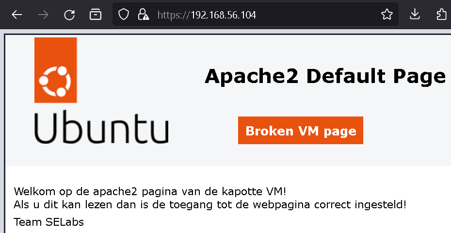
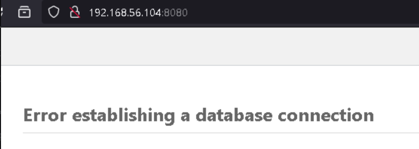
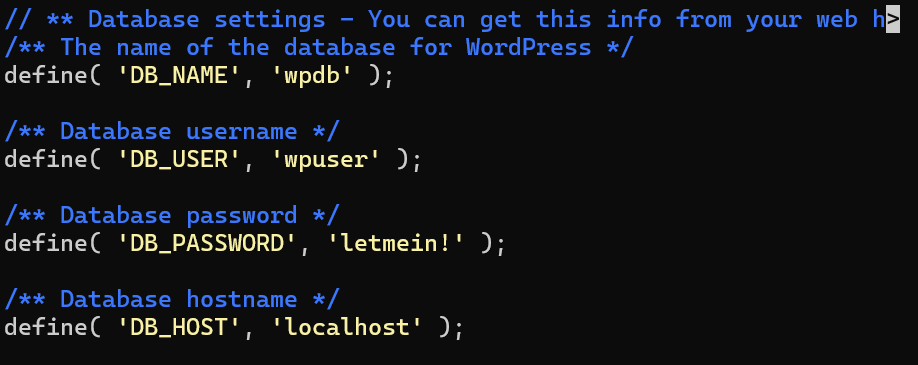
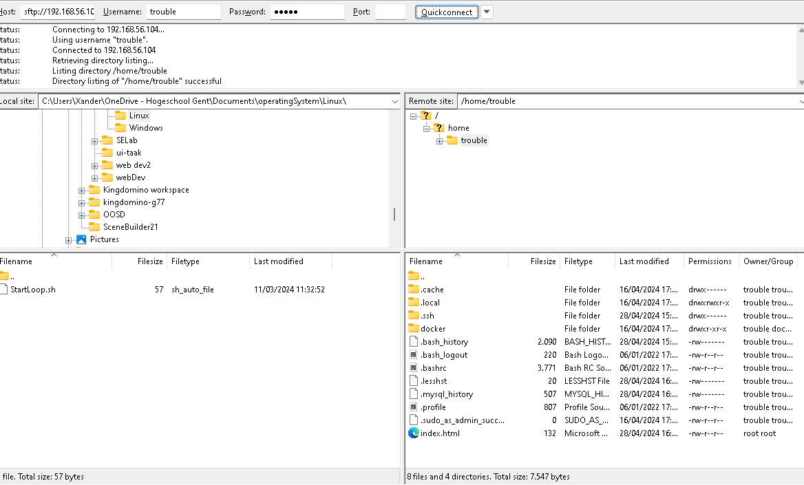
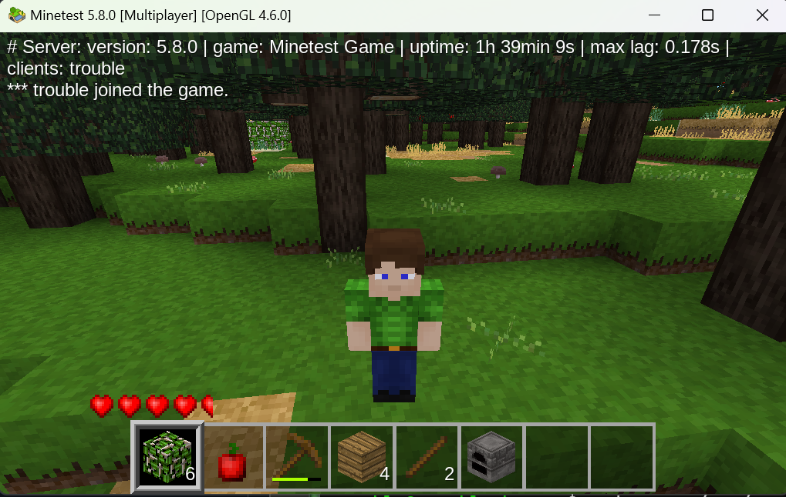
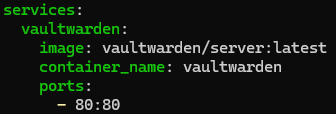
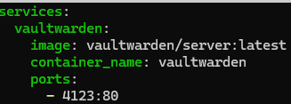
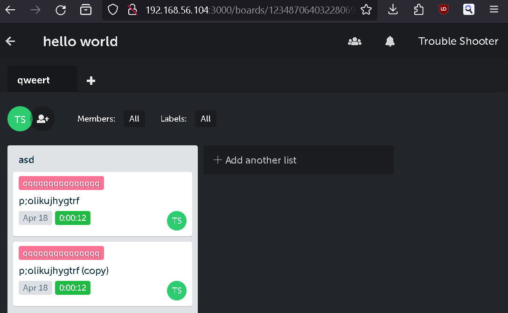

> Naam verslaggever: Xander

## Beschrijving

Voor deze opdracht werd er van ons verwacht dat we elk een eigen kapotte virtuele hard disk gaan troubleshooten wat kort wil zeggen dat we de kennis van vorige 5 opdrachten samenbundellen om fouten in het systeem op te lossen.

## Antwoorden op de vragen in de opdracht

### netwerk

Type 4 , 3 en 5
netwerk probleem werd opgelost door volgend commando.

```bash
sudo nano /etc/netplan/e1-xxxx.yaml
```

dhcp4 stond op false dhcp4 true zetten en dan kan er via externe host gepingd worden op 192.168.56.20.

### webserver (apache2)

Type 1,
de apache2 service wast niet bereikbaar via host systeem. Om dit op te lossen niet active and running was dit werd ontdekt door volgend commando.

```bash
sudo systemctl apache2 status
```

Om dit op te lossen werd volgend commando uitgevoerd.

```bash
sudo systemctl enable apache2
```



### Databankserver (mariadb)

Type 1,
de gebruiker wpuser bestond nog niet in de database en moest toegevoegd worden.
`show grant for 'wpuser'@'localhost'`
om dit op te lossen werd de wpuser aangemaakt en ook direct alle privileges gegeven zoals gezien bij opdracht-2-databankserver

```mysql>
create user 'wpuser'@'%' identified by 'letmein!';
grant all privileges on *.* to 'wpuser'@'%' with grant option;
flush privileges;
```

### Wordpress

Type 1 ,
het probleem met wordpres was dat de username,wachtwoord en databasenaam waren door elkaar gehaald. We kregen deze melding als er werd geprobeerd naar de wordpress-site te gaan.



Vervolgens werd er in de wordpress-config gekeken om de fouten eruit te halen.

```bash
sudo nano /var/www/wordpress/wp-config.php
```



Dit de juiste instelling van de wordpress-config file.
Vervolgens was het mogelijk om de site te bezoeken.


### SSH

type 1 ,
Vervolgens hadden we een probleem met de ssh-connectie van host naar vm. eerst hebben we gekeken of de firewall aanstaat en of de juiste poort 22 toegelaten is.

```bash
sudo ufw status verbose
sudo ufw allow in <poort>/<protocol>
```

Dit werkte leverde voor ons een connection failure op. Vervolgens hebben OpenSSH-client en server opnieuw op onze vm gezet.

```bash
sudo apt-get purge OpenSSH-client
	 sudo apt-get purge OpenSSH-server
	  sudo apt-get install OpenSSH-client
	   sudo apt-get install OpenSSH-server
	  sudo journalctl -t sshd
```

Toen kon er via filezilla op de vm files transferen en was het mogelijk om via de powershell terminal ssh connectie te starten naar de vm met volgend commando.

```shell
 ssh trouble@192.168.56.20
```



### Docker

#### Minetest

Er werd geprobeerd verbinding te maken dit lukte niet dus werd deze container heropgestart.

```bash
docker compose up -d
```



#### Vaultwarden

type 1,
Er was een foutief ingestelde poort van vaultwarden in het docker-compose.yml file dit was ingesteld op 80:80 maar vaultwarden draait op poort 4123 : 80.

```bash
sudo nano /docker/docker-compose.yml
```



Na aanpassing ziet het er zo uit.



#### planka

type 1 ,
Het probleem bij Planka container was dat de Secret key in commentaar stond de # verwijderen en de container opnieuw opstarten.

```bash
sudo nano /docker/planka/docker-compose.yml
```


```bash
sudo docker compose up -d
```



## Evaluatiecriteria

Toon na afwerken het resultaat aan je begeleider. Elk teamlid moet in staat zijn om het resultaat te demonstreren bij de oplevering van deze opdracht! Criteria voor beoordeling:

- [ ] Er is een volledig werkende virtuele machine volgens de eindsituatie.
- [ ] Je hebt een verslag gemaakt op basis van het template.
  - [ ] Het verslag bevat een duidelijke beschrijving van de problemen die je hebt gevonden mét de oplossingen. **Per type machine is er een aparte beschrijving!**
- [ ] De cheat sheet werd aangevuld met nuttige commando's die je wenst te onthouden voor later.

## Problemen en oplossingen

Tijdens het uitvoeren van de vorige opdrachten hebben jullie waarschijnlijk al gemerkt dat niet alles van de eerste keer lukt en dat bepaalde zaken niet werken zoals ze zouden moeten. Dit is vergelijkbaar met situaties die je kan tegenkomen in het bedrijfsleven, waarbij je geconfronteerd wordt met problemen die moeten worden opgelost door fouten op te sporen en te corrigeren.

Troubleshooting is dan ook een essentiële vaardigheid voor toekomstige systeembeheerders, en in deze opdracht willen we jullie kennis laten maken met deze vaardigheid. Om deze opdracht succesvol af te ronden, zul je een systematische aanpak moeten hanteren om de mogelijke problemen te detecteren en in een logische volgorde op te lossen. Het document [debugging-selab.md](https://github.com/HOGENT-SELab/selab-2324-g77/blob/main/cheat-sheets/debugging-selab.md) kan je hierbij helpen.

Het is zeer belangrijk om alle kennis toe te passen die je in de voorgaande opdrachten hebt opgedaan. Veel succes!

### Probleem 1 - Korte beschrijving van het probleem

## Voorbereiding demo

## Reflecties

#### Reflectie Xander Beuselinck

Ik vond deze opdracht persoonlijk wel wat leuker hier en daar botste ik op een probleem maar omdat we allemaal soortgelijke problemen hadden werd een oplossing voor ene probleem heel snel gevonden. Meeste oplossingen voor problemen waren ook terrug te vinden in vorige labo's.

#### Thomas Lambrecht

Ik was echter geen fan van deze opdracht. Deze opdracht was vrij moeilijk. Ik persoonlijk had het opdracht maar tot een goed einde kunnen brengen over een periode van 2 weken en 3 opnieuw verse installaties.  Ik had heel veel problemen met wat ik vermoed is DHCP, waarbij steeds opnieuw de ip `192.168.56.103/24` terug kwam. En wanneer je die hard verwijderde breekt de machine en krijg je  `WARNING: REMOTE HOST IDENTIFICATION HAS CHANGED!`. Echter na de 3de versie was dit eindelijke opgelost.

## Bronnen

https://github.com/HOGENT-SELab/selab-2324-g77/tree/main/opdrachten
https://docs.docker.com/engine/install/ubuntu/
