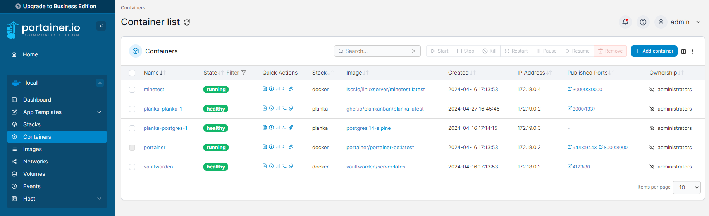

<style>
    p, ul, li {font-size: 20px;}
    a{color:grey; text-decoration:underline;}
    a:hover{color:#eee;}
    section{justify-content:flex-start;}blockquote{
      color: #5865f2;
      border-left: 0.25em solid #5865f2;
   }
</style>

<!-- _paginate: false -->

---


# Opdracht 6 - Troubleshoot

**Outline**

1. Voorbereiding
2. Beginsituatie
3. Afwijking ten op zichte van labo's
4. Gewenste eindsituatie
   1. Netwerk
   1. Webserver (apache2)
   1. Databankserver (mariadb)
   1. Wordpress
   1. Wordpress
   1. SSH
   1. Docker

> Mauro, Maxence, Robin, Thomas , Xander

<!-- _footer:  Foto: [vrtnws.be/~/kat-galena-per-post-verstuurd](www.vrt.be/vrtnws/nl/2024/04/29/kat-galena-per-post-verstuurd) -->

---

<!-- header: Voorbereiding -->

# Nieuwe VM aanmaken


- 1 CPU
- 4 GB RAM
- 128 MB display memory
- Geen HDD, we koppelen deze later
- 2 netwerkadapters:
  - #1: NAT
  - #2: Host-only adapter gekoppeld aan 192.168.56.1/24 netwerk met DHCP range van 192.168.56.100 tot 192.168.56.254


---

# Nieuwe VM aanmaken

- **Type 1** - Xander
- **Type 2** - Robin
- **Type 3** - Thomas
- **Type 4** - Mauro
- **Type 5** - Maxence


---

<!-- header: Beginsituatie -->

# Beginsituatie

- 5 fouten
- 5 personen
- 1 extra geïnstalleerd programma

We kregen de volgende accounts

- **Ubuntu** `trouble` `shoot`
- **SSH** `trouble` `shoot`
- **MariaDB** `admin, appusr, wpuser` `letmein!`
- **Wordpress** `wpuser` `letmein!`
- **Planka** `troubleshoot@selab.hogent.be` `shoot`
- **Portainer** `admin` `troubleshoot`

Volgende accounts moesten we aanmaken.

- **Minetest** `trouble` `shoot`
- **Vaultwarden** `troubleshoot@selabs.hogent.be` `shoot`

---


# Beginsituatie

Volgende poorten werden opgengesteld/gekoppeld en moeten gebruikt worden:

- **HTTP**: `80`
- **HTTPS**: `443`
- **MySQL**: `3306`
- **Planka**: `3000`
- **Portainer**: `9443`
- **SSH**: `22`
- **Vaultwarden**: `4123`

---

<!-- header: Afwijking ten op zichte van labo's -->

# Afwijking ten op zichte van labo's

Omdat er, zoals hierboven vermeld, geen GUI voorzien is, zijn volgende instellingen anders of niet gebeurd zoals in de labo's:

- Statisch ip: dit is gebeurd door gebruik te maken van `netplan`. Lees zeker de man-page na voor de werking en configuratie hiervan.
- Automatisch aanmelden en screenlock werden niet ingesteld en moeten ook niet ingesteld worden. Deze zijn geen onderdeel van het labo.
- Aangezien we geen domeinnaam hebben, draait Wordpress niet op https maar http, dus zonder ssl.
- Planka werd geïnstalleerd volgens de installatie-instructies voor docker compose die terug te vinden zijn op de officiële website. De installatie is via een aparte docker-compose file (~/docker/planka/), dus los van die voor Portainer/Mintest/Vaultwarden. Deze blijven ook gescheiden.
- :warning: Voor planka werd in de docker-compose file de waarde voor `restart: on-failure` zoals die in de officiële documentatie vermeld staat aangepast naar `restart: always` omdat dit anders problemen gaf. Je laat dit dus ook zo staan. Dit is wordt dus niet aanzien als fout!

> - Enkele onderdelen zijn anders omdat er geen GUI aanwezig is.
> - Extra info over planka

<!-- _footer: Bron: Github SE-Lab Opdracht 6 -->

---

<!-- header: Gewenste eindsituatie -->

# Gewenste eindsituatie

**Outline** gewenste eindsituatie:

1.  Netwerk
1.  Webserver (apache2)
1.  Databankserver (mariadb)
1.  Wordpress
1.  SSH
1.  Docker

---

### Netwerk: Het toestel beschikt over internet.

> Problemen op `type 3`,`type 2`, `type 4`, `type 5`,

dhcp4 stond op false dhcp4 true zetten en dan kan er via externe host gepingd worden op 192.168.56.20.

```bash
sudo nano /etc/netplan/01-network-manager-all.yaml
```


---

### Netwerk: <br> Het toestel kan via externe host gepingd worden op 192.168.56.20.

> Problemen op `type 2`, `type 5`


---

### Webserver (apache2): Webserver bereikbaar via de browser in de hostomgeving.

> Problemen op `type 1`, `type 3`, `type 4`


---

### Webserver (apache2): Files uploaden via FileZilla.

> Problemen op `type 1`, `type 4`, `type 5`


_De folder `/www/data` bestaat niet, maar bestanden kunnen overgezet worden._

---

### Databankserver (mariadb): Databank `appdb` moet bereikbaar zijn via MySQL Workbench voor de gebruiker `appusr` met wachtwoord `letmein!`.

> Problemen op `type 1`, `type 2`, `type 3`, `type 4`, `type 5`,


---

### Databankserver (mariadb): Moet lokaal toegankelijk zijn vanaf de VM zelf via het MYSQL-commando voor de gebruiker `admin` met wachtwoord `letmein!`

> Problemen op `type 1`, `type 4`


---

### Wordpress: Bereikbaar via de browser in de hostomgeving.

**voor de gebruiker wpuser en het wachtwoord letmein! en gebruikt de database wpdb.**


> Problemen op `type 1`, `type 2`

---

### Wordpress: Een blogpost aanmaken.

**voor de gebruiker wpuser en het wachtwoord letmein! en gebruikt de database wpdb.**

> Problemen op `type 1`, `type 2`, `type 5`


---

### SSH: Verbinding maken

> Problemen op `type 1`, `type 3`, `type 4`, `type 5`


---

### Docker: Container draaien

> Problemen op `type 1`, `type 2`




---

### Docker: Portainer en Vaultwarden zijn extern bereikbaar

> Problemen op `type 1`, `type 3`


---

### Docker: <br> Spel joinen in Minetest

> Geen problemen


---

### Docker: Planka draait

> Problemen op `type 1`, `type 2`, `type 4`


---

<!-- header:  Foto: [vrtnws.be/~/kat-galena-per-post-verstuurd](www.vrt.be/vrtnws/nl/2024/04/29/kat-galena-per-post-verstuurd) -->


```

   Geen zorgen.
   Galena is veilig terug thuis geraakt.

```
