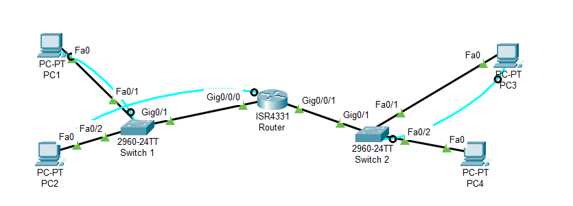
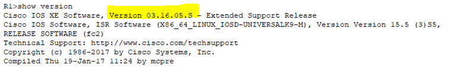
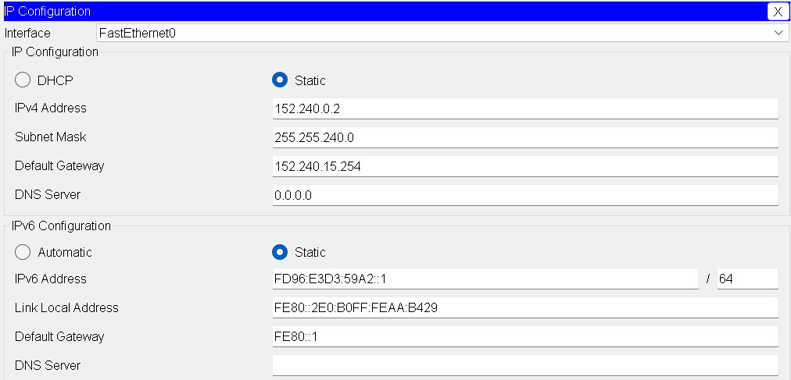
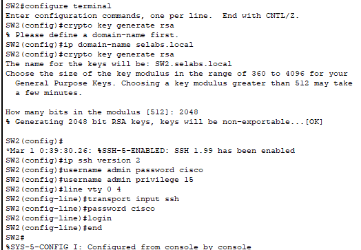
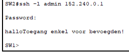

<!-- _paginate: false -->

# Opdracht 7 - Het opzetten, configureren en testen van een eenvoudig netwerk in Packet Tracer

**Outline**

1. Topologie
2. Adresseringsschema voor IPv4
3. Adresseringsschema voor IPv6
4. Bijwerken software op router/switch
5. Configuratie van de PC's
6. Configuratie van de switches
7. Configuratie van de router
8. Instellen SSH-toegang

> Mauro, Maxence, Robin, Thomas , Xander

---

# 1. Topologie

> Namaken van de topologie die we vonden op github:

---

# 2. Adresseringsschema voor IPv4

- IP: 152.240.81.175
- Prefix: 20  
   ➡️ Subnetmask = 255.255.240.0

  - 255.255.240 = 11111111.11111111.111**1**0000.00000000 -> Magic Number: 16

- 152.240.0.0 -> 152.240.15.255
- 152.240.16.0 -> 152.240.31.255
- 152.240.32.0 -> 152.240.47.255
- 152.240.48.0 -> 152.240.63.255

2^12(= aantal hostbits(0'en in subnetmask)) = 4096
➡️ 4094 hosts

---

| **Toestel** | **Interface** | **Subnetnr.** | **IPv4-adres** | **Subnetmask** | **IPv4-adres default gateway** |
| ----------- | ------------- | ------------- | -------------- | -------------- | ------------------------------ |
| PC1         | NIC           | 0             | 152.240.0.2    | 255.255.240.0  | 152.240.15.254                 |
| PC2         | NIC           | 0             | 152.240.0.3    | 255.255.240.0  | 152.240.15.254                 |
| PC3         | NIC           | 1             | 152.240.16.2   | 255.255.240.0  | 152.240.31.254                 |
| PC4         | NIC           | 1             | 152.240.16.3   | 255.255.240.0  | 152.240.31.254                 |
| SW1         | VLAN 1        | 0             | 152.240.0.1    | 255.255.240.0  | 152.240.15.254                 |
| SW2         | VLAN 1        | 1             | 152.240.16.1   | 255.255.240.0  | 152.240.31.254                 |
| R1          | G0/0/0        | 0             | 152.240.15.254 | 255.255.240.0  | n.v.t.                         |
| R1          | G0/0/1        | 1             | 152.240.31.254 | 255.255.240.0  | n.v.t.                         |

---

# 3. Adresseringsschema voor IPv6

- IP: fd96:e3d3:59a2:SP::
- Prefix: /64
  ➡️ Subnetmask = /64

- 2^64 (= aantal hostbits(0'en in subnetmask)) = 18 446 744 073 709 551 616
  ➡️ 18 446 744 073 709 551 614 hosts

2 Subnetten:

- fd96:e3d3:59a2:1::
- fd96:e3d3:59a2:2::

---

| **Toestel** | **Interface** | **Subnetnr.** | **IPv6-adres**         | **Subnet** | **IPv6-adres default gateway** |
| ----------- | ------------- | ------------- | ---------------------- | ---------- | ------------------------------ |
| PC1         | NIC           | 0             | fd96:e3d3:59a2:0::1    | /64        | FE80::1                        |
| PC2         | NIC           | 0             | fd96:e3d3:59a2:0::2    | /64        | FE80::1                        |
| PC3         | NIC           | 1             | fd96:e3d3:59a2:1::1    | /64        | FE80::1                        |
| PC4         | NIC           | 1             | fd96:e3d3:59a2:1::2    | /64        | FE80::1                        |
| SW1         | VLAN 1        | 0             | fd96:e3d3:59a2:0::FFFE | /64        | fd96:e3d3:59a2:0::3            |
| SW2         | VLAN 1        | 1             | fd96:e3d3:59a2:1::FFFE | /64        | fd96:e3d3:59a2:1::3            |
| R1          | G0/0/0        | 0             | fd96:e3d3:59a2:0::3    | /64        | n.v.t.                         |
| R1          | G0/0/1        | 1             | fd96:e3d3:59a2:1::3    | /64        | n.v.t.                         |

---

# 4. Bijwerken software op router/switch

- De URL die wij gekregen hebben van github werkt niet (op meerdere apparaten getest):

  > https://yaser-rahmati.gitbook.io/rahmati-academy/Tutorials-Library/cisco-adademy/cisco-packet-tracer/use-a-tftp-server-to-upgrade-a-cisco-ios-image

- Versie checken met `show version`

---

# 5. Configuratie van de PC's

- Instellen IPv4 en IPv6, subnetmask, default gateway en prefixlengte

---

# 6. Configuratie van de switches

---

# 7. Configuratie van de router

- `enable`
- `configure terminal`
- `interface gig 0/0/0`
- `ip address (adres) (mask)`
- `interface gig 0/0/1`
- `ip address (adres) (mask)`
- `exit`
- `exit`
- `copy running-config startup-config`

---

# 8. Instellen SSH-toegang

